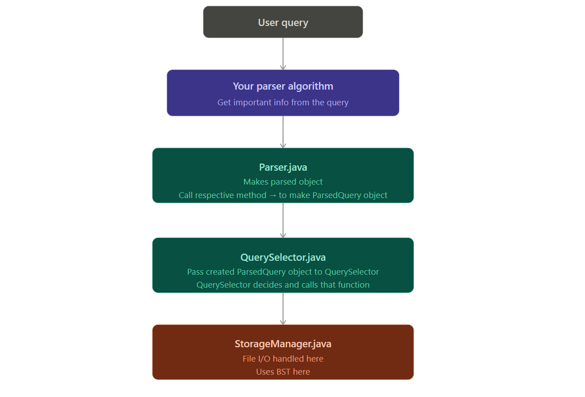

**************************** CLASSES ***************************************************8

1. BSTIndex.java → Binary search tree impl.
2. BSTNode.java → Node class used in BST.
3. ParsedQuery.java → Class to hold information about the query user entered, like DB name, values, constraints etc.
4. Parser.java → Have methods to populate the ParsedQuery object by calling respective methods. If user has entered a create table query → you will call createTable method of this class and pass into info like → attrs, constraints.
5. QuerySelector.java → Class that looks at the parsed query object parsed and decides which low level file management functions to call to make thing happen.
6. StorageManager.java → Handles file I/O at lowest level.

***************************** FLOW OF EXECUTION ******************************
User enters the query => the grammar parsers you guyz wrote will validate it => have your parser extract necessary info from it => call methods from the parser.java to populate respective fields in the parsedQuery object and to start the manipualtion process. After creation of the object, the parser.java class itself calls various respective methods to get the thing done (mainly talking to storageManager and bstindex)

******************************* NOTES ****************************************************

THINGS TO DO ===> you just have to look at the parsedQuery.java methods, retrive that info from the query and pass to respective methods

I HAVE A METHOD CALLED BUILDER IN PARSEDQUERY.JAVA THAT IS HARDCODED. JUST TO TEST OUT MY FLOW AND LOGIC. THAT WILL BE REPLACED BY YOUR GRAMMMAR PARSING AND CALLING FROM THERE. SO, SEE HOW THE HARCODED VALUES GETS POPULATED AND FLOWED TO KNOW WHAT VALUES ARE TO BE PASSED TO METHODS FROM YOUR GRAMMER PARSER FOR EACH QUERY RESPECTIVLEY FOR IT TO WORK AS IS

NOTE: everytime we create a database, a new folder is created. for instance I tested using University database that is given in the code. for each table in a database, we have 3 files: meta-data, data, binary search tree

if u guyz find any problems plz put in discord chat

